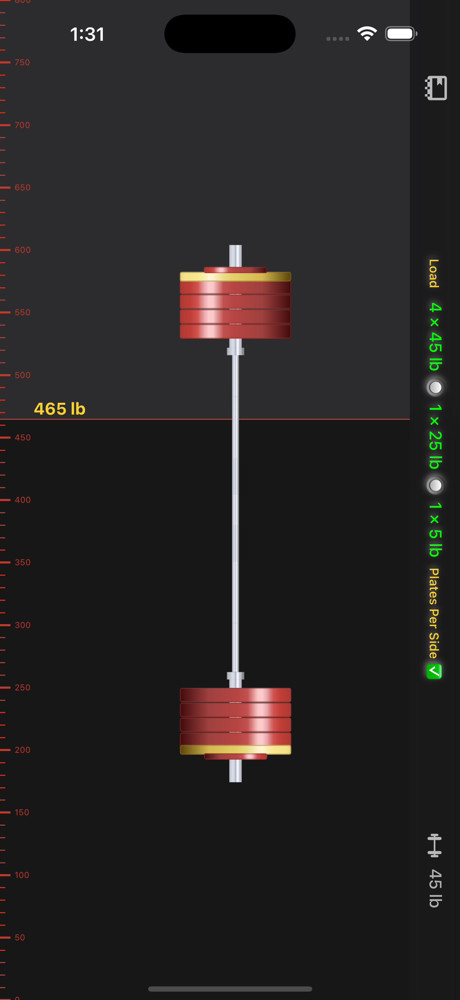

# Barlog 🏋️‍♂️

[](https://apps.apple.com/us/app/barlog/id6737152762)
[](https://keiver.dev/lab/barlog)
[](https://reactnative.dev)
[](https://expo.dev)

**Barlog** turns plate‑math into a one‑swipe task. Dial in any target weight with a _snap‑to‑value_ slider and feel a gentle haptic pop when you hit the mark.

> Built for powerlifters, CrossFit® athletes, and garage‑gym tinkerers who hate mental math between sets.

---

<div align="center">
  
  
  
</div>

---

<div align="center">

  
  
  
</div>

---

## ✨ Features

|                           |                                                                               |
| ------------------------- | ----------------------------------------------------------------------------- |
| **Snap‑to Slider**        | Full‑screen, vertical; snaps to significant values with _haptic confirmation_ |
| **Smart Calculator**      | Displays the **minimal plates per side** in real time                         |
| **One‑Tap Unit Switch**   | lb ⇆ kg without losing your place                                             |
| **Custom Barbells**       | 15 lb – 45 lb (7 kg – 20 kg) bars & specialty bars supported                  |
| **Offline First**         | Works in remote garage gyms—no data needed                                    |
| **Dark‑Mode Aware**       | Respects system theme & reduced‑motion settings                               |
| **Apple Watch Companion** | On‑wrist weight control, synced units, and haptic cues                        |

---

## 📲 Download

| Platform           | Link                                                              |
| ------------------ | ----------------------------------------------------------------- |
| **iPhone + Watch** | [App Store ▶︎](https://apps.apple.com/us/app/barlog/id6737152762) |
| **Android (APK)**  | [Latest Release ⬇︎](https://github.com/keiver/barup/releases)     |

---

<div align="center">
  
  
  
  <!--  -->
</div>

## 🛠️ Tech Stack

- **React Native 0.76** + **Expo SDK 52**
- **TypeScript**
- **react‑native‑reanimated** • **gesture‑handler** • **react‑native‑svg**
- Custom **TurboModules** for WatchConnectivity

---

## 🚀 Quick Start

```bash
# Clone & install deps
$ git clone https://github.com/keiver/barup.git && cd barup
$ pnpm install   # or yarn / npm i

# Run on device / simulator
$ pnpm ios        # iOS
$ pnpm android    # Android
```

The project ships with the **new architecture** and **Hermes** enabled. See `package.json` for all scripts.

---

## 🤝 Contributing

Bug reports and pull requests are welcome. Please follow the conventional‑commit style and run `pnpm lint` before opening a PR.

---

## 🏷️ Credits

- [`rn‑vertical‑slider`](https://github.com/sacmii/rn-vertical-slider) • sacmii
- Inspired by [`Bar Is Loaded`](https://apps.apple.com/us/app/bar-is-loaded-gym-calculator/id1509374210)

---

## 📄 License

[MIT](./LICENSE)
