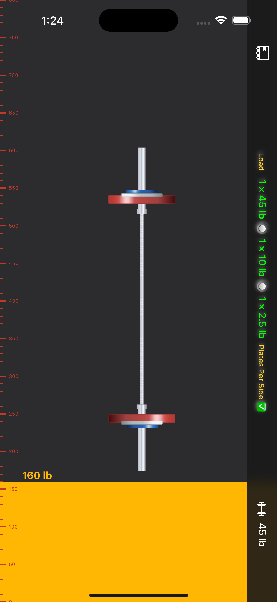
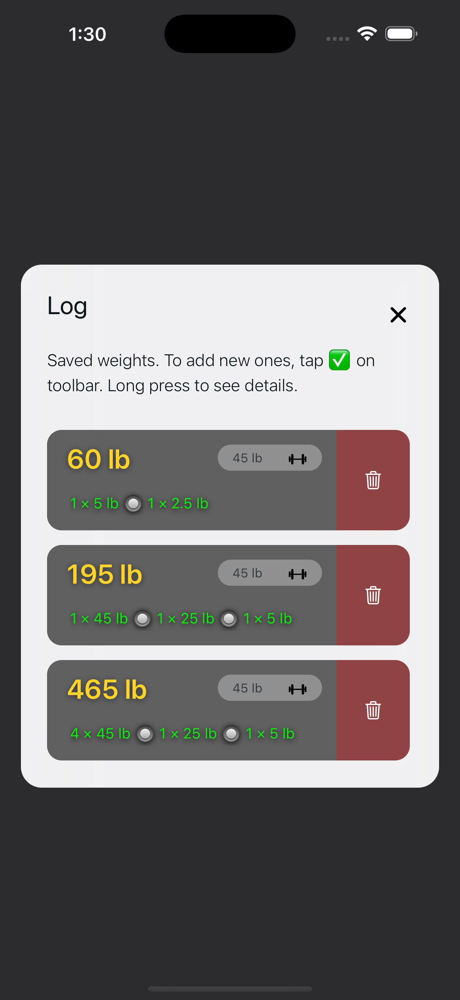

# Barlog 🏋️‍♂️

Minimalist plate calculator that shows the optimal weight configuration for your barbell. Perfect for powerlifters, CrossFit athletes, and gym enthusiasts.

  
  
  
  
  
  
  
  
  

## Features

- **Intuitive Slider**: Full-screen vertical slider for quick weight adjustments
- **Smart Calculator**: Shows minimum plates needed for target weight
- **Real-time Updates**: Watch plate configurations update instantly
- **Unit Toggle**: Switch between lb/kg with one tap
- **Custom Bar**: Support for different barbell weights
- **Offline Ready**: No internet required
- **Dark Mode**: Easy on the eyes

## Download

- **iOS**: [App Store](https://apps.apple.com/us/app/barlog/id6737152762)
- **Android**: [Download APK](https://github.com/keiver/barup/releases) (Self-hosted)

## Support

Email: support@keiver.dev

## Credits

Built with help from [rn-vertical-slider](https://github.com/sacmii/rn-vertical-slider) (sacmii) and inspired by [Bar Is Loaded](https://apps.apple.com/us/app/bar-is-loaded-gym-calculator/id1509374210).
